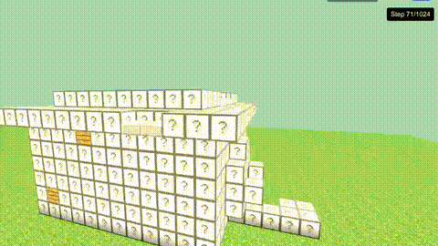
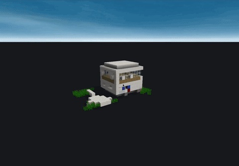
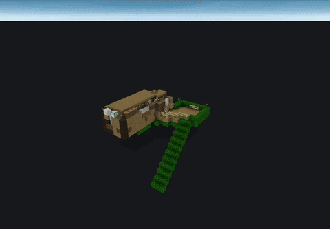
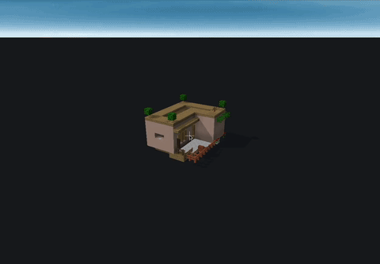

# Scaffold Diffusion: Sparse Multi-Category Voxel Structure Generation with Discrete Diffusion
<p align="center">
  
</p>

## Abstract
Generating realistic sparse multi-category 3D voxel structures is difficult due to the cubic memory scaling of voxel structures and moreover the significant class imbalance caused by sparsity. We introduce Scaffold Diffusion, a generative model designed for sparse multi-category 3D voxel structures. By treating voxels as tokens, Scaffold Diffusion uses a discrete diffusion language model to generate 3D voxel structures. We show that discrete diffusion language models can be extended beyond inherently sequential domains such as text to generate spatially coherent 3D structures. We evaluate on Minecraft house structures from the 3D-Craft dataset and demonstrate that—unlike prior baselines and an auto-regressive formulation—Scaffold Diffusion produces realistic and coherent structures even when trained on data with over 98% sparsity. We provide an interactive viewer where readers can visualize generated samples and the generation process. Our results highlight discrete diffusion as a promising framework for 3D sparse voxel generative modeling.

## Generated examples

<p align="center">
  
  
  
</p>

For further details, see:
- Project page (live demo): https://scaffold.deepexploration.org/ 
- Paper link: https://arxiv.org/pdf/2509.00062

## Code structure and setup
This code structure uses hydra and is heavily adapted from https://github.com/kuleshov-group/mdlm/tree/master. When running training and evaluation scripts, please make sure to check and make changes to the `configs/config.yaml`.

The dataset and data code is from https://github.com/facebookresearch/voxelcnn. 
Please follow their readme on instructions on how to install the 3D-craft dataset. Once complete, the data folder
should look like 
```
data/
├── houses/
├── houses.tar.gz
├── splits.json
└── README
```

A requirements file `requirements.txt` is provided for ease of installation. However, to run the code, all that is needed is the packages from https://github.com/kuleshov-group/mdlm/tree/master and https://github.com/facebookresearch/voxelcnn. 

Once the environment is created, from the root directory please run 
`python real_generator.py` which should save a '32real_occupancy_maps.pth' file to your home directory.  

## Discrete Diffusion 
### Training 
Command:  `python main.py mode=train model=scaffold_diffusion model_name=scaffold_diffusion`

### Generation 
Please first add a path to the diffusion model checkpoint to the  `eval.checkpoint_path` variable in `configs/config.yaml`.

Command:
`python main.py mode=sample_eval model=scaffold_diffusion model_name=scaffold_diffusion`

Results will be saved as a generated folder under `/output_files`.

## Baselines
**Autoregressive baseline**:

Command: `python main.py mode=train model=ar_baseline model_name=ar_baseline`

**(Lee et al. 2023) baseline**:

First train the VQVAE.

Command: `python main.py mode=train model=vqvae_baseline model_name=vqvae_baseline`

Add the trained ckpt to `configs/config.yaml`. Then train the latent multinomial diffusion.

Command: `python main.py mode=train model=latent_multinomial model_name=latent_multinomial`

## Code acknowledgements 
We are grateful for the open source projects MDLM (https://github.com/kuleshov-group/mdlm/tree/master) for providing training and discrete diffusion code and (VoxelCNN) for the datasets and data processing code (https://github.com/facebookresearch/voxelcnn).


## Citing
```
@inproceedings{jung2025scaffolddiffusionsparsemulticategory,
      title={Scaffold Diffusion: Sparse Multi-Category Voxel Structure Generation with Discrete Diffusion}, 
      author={Justin Jung},
      booktitle={Workshop on Structured Probabilistic Inference {\&} Generative Modeling at NeurIPS 2025},
      year={2025},
      url={https://arxiv.org/abs/2509.00062}, 
}
```
